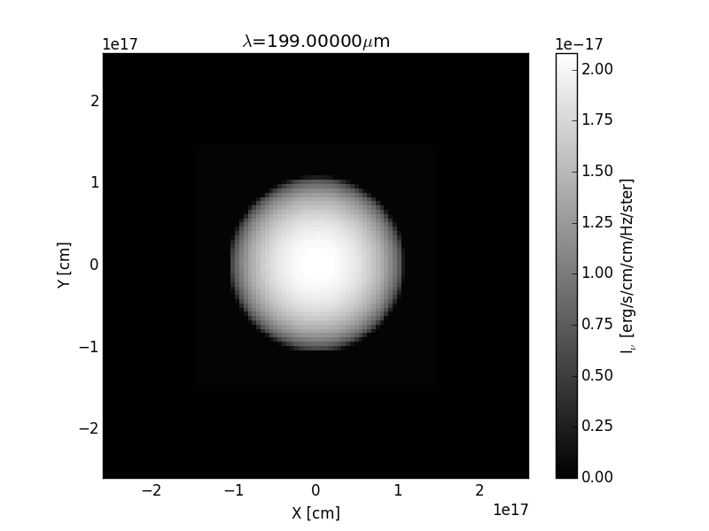

"How good is dust emission as a tracer of structure in star-forming molecular clouds?"
================================================================================

Project Overview
----------------

This project probes the structure of star forming regions in molecular clouds
by using dust emission as a tracer.

This repository contains all code (written exclusively in Python) pertaining to
the project. At present, the only specialist package used is RADMC-3D, a raytracing
radiative transfer code (http://www.ita.uni-heidelberg.de/~dullemond/software/radmc-3d/).

Project Aims
------------

The primary (simplified) aims of this project are:

- to simulate a molecular cloud containing x amount of pre-stellar cores (i.e. generate synthetic data)
- to produce a dendogram (https://dendrograms.readthedocs.org/en/latest/) of the
  resulting simulation to probe the structure of the simulated cloud
- compare with other simulations

Project Progress
----------------

20/11/15: Custom data files for RADMC-3D are now generated with a Python script that asks for user defined quantities. It is possible to compute the radius of the molecular cloud from its mass and density (the code requests number density and converts this to g/cm^3). The resulting radius is then used to help define the image width (i.e. the user is told what the cloud radius is so as to make appropriate adjustments to the image width). Furthermore this width is split into n user defined pixels and each pixel in each dimension looped over to assign density and temperature.

These files are then copied over to the directory that the image raytrace is performed. By invoking `radmc3d image` the raytrace is then performed (providing all the information required is written to the `problem-params.inp` file - this is usually performed in model setup, ie `radmc3dPy.analyze.writeDefaultParfile('model_name')`). Allowing the code to run produces an image as seen below:

IMPORTANT: ALL UNITS MUST BE CGS (centimetre-grams-second)

As of 11/10/15 minor tests have been performed of RADMC-3D in Python
to ascertain its viability for the project. Those tests setup various simple
problems and simulations, the most useful of which is the creation of a 2D (as well
as 1D) sphere of uniform temperature.

As of 14/10/15 more complex simulations have been set up ([#1](https://github.com/tomasjames/ZiggyStarDust/issues/1) handles this).

Project 'To-Do List'
-------------------
This list is not exhaustive of the remaining tasks in the project, and is updated as and when
new ideas are added. Furthermore, this is not representative of the project's progress. More
often than not, for larger implementations more detailed issues will be created in addition
to the notes found here. Where possible, those issues will be linked next to the entry.

- [x] Get RADMC-3D up and running on OS X 10.11 El Capitan
- [x] Run basic tests included in cheatsheet (i.e. set up gas and dust continuum models)
- [x] Generate sphere of uniform temperature:
  - [x] in 1D &,
  - [x] 2D
- [x] Begin collecting BiBTeX library of references for report
- [ ] Generate a 3D sphere and place a source (e.g. star) behind to assess radiative transfer. Use:
  - [x] Different opacity law (see notes in notebook for papers)
  - [x] Standard 1/r**2 density profile (i.e. decreasing with radius)
  - [x] Standard molecular cloud temperature profile (cooler in the cloud relative to the exterior)
    (See [#1](https://github.com/tomasjames/ZiggyStarDust/issues/1) for updates)
  - [x] Investigate the `ValueError: zero-size array to reduction operation minimum which has no identity` error that RADMC-3D is throwing when trying to run the raytrace with all custom files in place.
  - [ ] Implement IRF
